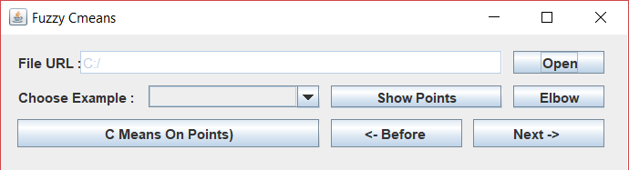
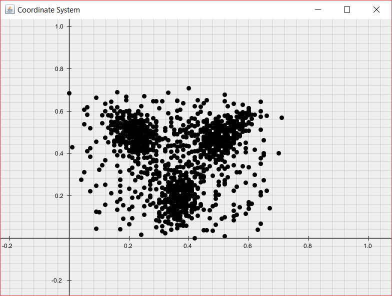
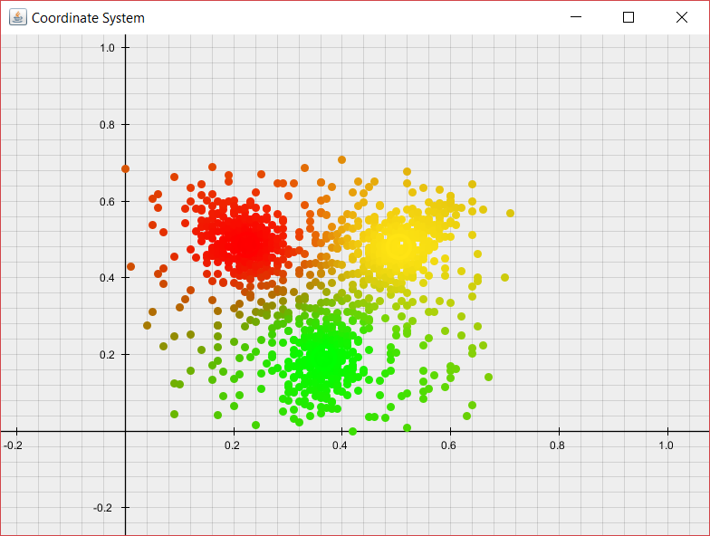

### Fuzzy C Means Görsel Kümeleme Uygulaması

Örneklem uzayında veriyi temsil eden kordinatlar belirlenen küme sayısı parametresine göre cümeleme işlemi yapılmaktadır. Küme sayısı belirlenemediği durumlarda Elbow Tekniği ile yaklaşık bir küme sayısı tespit edilmeye çalışılmıştır. Elde edilen küme görüntüsü rgb (red/green/blue) formatında renklendirilmiştir. Kümeye aitlik derecesine göre her bir nokta renklendirilmiştir. 

#### Arayüz tasarımı

**File URL: (Open button after)** Dinamik olarak seçilen .csv uzantılı örneklem.
**Choose Example:** Önceden tanımlı örneklem seçilebilmektedir.
**Show Points:** Algoritma çalışmadan önce örneklemi gözlemlemek için hazırlanmış ekran.
**Elbow:** Küme sayısının tespit edilmesi için kullanılan tekniğin uygulanma ekranı.
**C Means On Points:** Uygulamanın çalıştırıldığı pencere
** <- Before:** Algoritmanın bir önceki adımına geri dönmek için kullanılır. (Algoritmanın çalıştırılması gerekmektedir.)
** After ->:** Algoritmanın bir sonraki adıma geri dönmek için kullanılır.(Algoritmanın çalıştırılması gerekmektedir.)

#### Örneklem görüntüsü:

#### Örneklem Fuzzy C Means uygulama sonrası görüntüsü:

